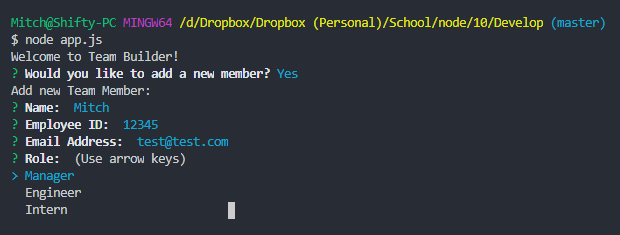

# Team Builder Template Engine

## Description

A node application to easily build a team web page.

## Table of Contents

* [Installation](#installation)
* [Usage](#usage)
* [Credits](#credits)
* [License](#license)

## Installation

Clone repo, or download.

## Usage 

1. Open downloaded folder
2. Run npm install to download inquirer, and test dependencies.
3. Run 'node app.js' in the command line.

## Credits

[Mitch Henderson](https://shiftymitch.github.io/portfolio/2)
-Wrote App, Employee, Manager, Engineer, and Intern js files.

## License

## Contributing

No contributing necessary. Just clone the repo and make adjustments as needed.

## Questions

Questions can be directed via email to shiftymitch@gmail.com